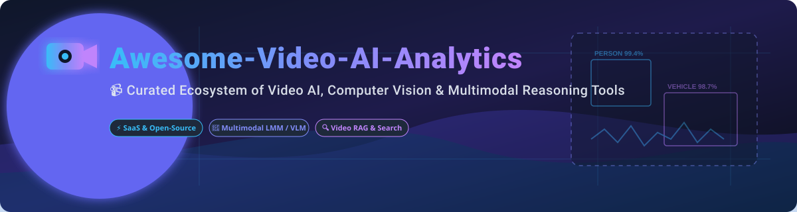

  

# 📹 Awesome-Video-AI-Analytics 🚀

## 🌟 Top Video AI Analytics Ecosystem & Tools 👁️✨

**Curated List of SaaS Products & Open-Source GitHub Projects for Video Understanding, Surveillance Analytics & Multimodal AI Reasoning** 🤖📹

*Last updated: October 2026* 📅

This repository tracks notable **SaaS platforms** and **open-source projects** for **Video AI Analytics**. These tools apply computer vision 👁️, deep learning 🧠, speech recognition 🎙️, and large multimodal models (LMMs / VLMs) to extract structured intelligence from video streams — detecting objects, tracking movement 🏃‍♂️, recognizing facial features 👤, transcribing audio, and enabling natural language temporal QA 🔍 and forensic search over video archives 🗄️.

---

## 📑 Table of Contents

- [📊 Market Intelligence & Industry Overview](#-market-intelligence--industry-overview)
- [☁️ SaaS / Hosted Platforms](#%EF%B8%8F-saas--hosted-platforms)
- [🔓 Open-Source GitHub Projects](#-open-source-github-projects)
- [🤝 How to Contribute](#-how-to-contribute)
- [📜 Disclaimer](#-disclaimer)
- [💖 Support & Community](#-support--community)
- [⭐ Star History](#-star-history)

---

## 📊 Market Intelligence & Industry Overview

The global **Video AI Analytics market** is estimated at **$11.59 Billion to $18.8 Billion in 2026**, projecting a high compound annual growth rate (CAGR) of **19.5% to 23.1%** through 2030+. 📈

> **📌 Market Fragmentation Note:** The sector is **moderately fragmented** — combining tech giants providing infrastructure-level video APIs with specialized computer vision, enterprise surveillance, and video foundation model startups. No single vendor holds a dominant "winner-take-all" monopoly. 🌐

---

## ☁️ SaaS / Hosted Platforms

| Product / Platform | Company Size (Revenue / Valuation) | Starting Pricing (Paid Tier) | Free Tier / Trial Limit | Key Video AI Capabilities |
| :--- | :--- | :--- | :--- | :--- |
| **[Microsoft Azure Video Indexer](https://azure.microsoft.com/en-us/products/ai-services/video-indexer)** 🔷 | **$245B+ Revenue / $3.1T+ Valuation** (Microsoft) | Pay-as-you-go (~$0.15/min video indexing) | **2,400 free indexing minutes** (API trial via dev portal) | Cloud service for extracting video & audio insights, face/emotion detection, OCR, transcription & scene segmentation. |
| **[Google Cloud Video Intelligence](https://cloud.google.com/video-intelligence)** 🔴 | **$307B+ Revenue / $2.1T+ Valuation** (Alphabet) | Pay-as-you-go (~$0.10/min stored video) | **1,000 free minutes/month** (stored & streamed analysis) | Label detection, shot change detection, explicit content moderation, object tracking & text detection. |
| **[AWS Rekognition Video](https://aws.amazon.com/rekognition/video/)** 🟧 | **$107B+ Segment Revenue / $2.0T+ Valuation** (Amazon) | Pay-as-you-go ($0.10/min video processed) | **60 free video analysis minutes/month** (first 12 months) | Video analysis service for object, face, pathing, and activity detection across stored & live RTSP streams. |
| **[BriefCam](https://www.briefcam.com/)** 📹 | **~$90M Acquisition / ~$9.1M Revenue** (Canon Group) | Per-camera annual license (Quote-based via partner network) | **Temporary PoC evaluation license** (via sales authorization) | Video Synopsis®, rapid surveillance review, multi-camera tracking, vehicle attribute search & zone analytics. |
| **[Twelve Labs](https://twelvelabs.io/)** 🧠 | **~$77M Funding / ~$150M+ Valuation** | $0.042 per minute indexed ($2.50/hour) | **600 free cumulative minutes** (Search, Embed & Analyze APIs) | Video foundation models enabling zero-shot video search, automatic summarization, and natural language QA. |
| **[Clarifai](https://www.clarifai.com/)** 👁️ | **~$101M Funding / ~$16.2M Revenue** | $30/month (Essential Plan) | **1,000 free operations/month** (Community Plan) | Full-stack AI computer vision platform for video classification, content moderation & visual search. |
| **[AnyVision / Oosto](https://www.anyvision.co/)** 👤 | **~$125M Acquisition / ~$352M Total Funding** | Enterprise tier quote (Custom deployment pricing) | **Sales-guided live demo** (No public self-service trial) | Enterprise-grade facial recognition, access control, and watchlist monitoring for physical security. |
| **[IronYun / Vaidio](https://www.ironyun.com/)** 🛡️ | **~$11.4M ARR / Venture-backed** | Enterprise subscription quote (Per-camera licensing) | **Sales-guided live demo** (Custom PoC evaluation available) | AI Vision Platform with 30+ video analytics features (license plate recognition, intrusion, fall detection). |
| **[Valossa](https://www.valossa.com/)** 🎬 | **Venture-backed / €29 Credit Pack** | €14.90/month (Valossa Assistant) | **7-day free trial** (No credit card required) | AI video analysis for automated content indexing, media compliance, explicit content detection & metadata generation. |
| **[ViSenze](https://www.visenze.com/)** 🛍️ | **~$34M Funding / Venture-backed** | Custom enterprise contract (Volume quote) | **30-day free trial** (Available upon demo request) | Visual search and image/video recognition platform optimized for video e-commerce & retail recommendation. |

---

## 🔓 Open-Source GitHub Projects

Below is a curated list of leading open-source projects for video AI, object detection, surveillance analytics, and multimodal video reasoning, sorted by GitHub star count (descending). ⭐

- **[ultralytics/ultralytics](https://github.com/ultralytics/ultralytics)**  ⚡  
  **State-of-the-art real-time computer vision and object detection framework (YOLOv8 & YOLO26)**. Provides real-time object detection, instance segmentation, multi-object tracking (ByteTRACK/BoT-SORT), pose estimation, and oriented bounding boxes (OBB) for video streams.

- **[roboflow/supervision](https://github.com/roboflow/supervision)**  🛠️  
  **Reusable computer vision utilities for video analytics**. Essential toolkit for video stream processing, zone detection, object counting, bounding box annotators, and tracking integrations with YOLO and ByteTrack.

- **[blakeblackshear/frigate](https://github.com/blakeblackshear/frigate)**  🏠  
  **NVR with real-time local AI object detection for IP cameras**. Integrates Google Coral TPU, TensorRT, and OpenVINO for low-latency, privacy-focused motion and object analysis over RTSP video streams.

- **[m-bain/whisperX](https://github.com/m-bain/whisperX)**  🎙️  
  **Automatic speech recognition with word-level timestamp alignment and speaker diarization**. Ideal for video audio transcription, subtitle generation, and video text search indexing.

- **[AlexeyAB/darknet](https://github.com/AlexeyAB/darknet)**  ⚡  
  **Classic C/CUDA open-source neural network framework for real-time video object detection (YOLOv4)**.

- **[ZoneMinder/zoneminder](https://github.com/ZoneMinder/zoneminder)**  📹  
  **Full-featured, open-source video surveillance software system**. Supports state-of-the-art camera capture, analysis, and event recording for home and commercial security.

- **[obss/sahi](https://github.com/obss/sahi)**  🎯  
  **Slicing Aided Hyper Inference (SAHI)** for performing small object detection in high-resolution video frames and aerial surveillance footage.

- **[open-mmlab/mmaction2](https://github.com/open-mmlab/mmaction2)**  🎬  
  **OpenMMLab Next-Generation Video Understanding Toolbox**. Provides state-of-the-art models for video action recognition, temporal action localization, spatial-temporal action detection, and video QA.

- **[kerberos-io/agent](https://github.com/kerberos-io/agent)**  ⚙️  
  **Open-source video surveillance agent written in C++**. Lightweight edge video processing agent designed for Kubernetes and Docker IoT deployments.

- **[bytedance/vidi](https://github.com/bytedance/vidi)**  🤖  
  **ByteDance's large multimodal model for video understanding**. Features spatio-temporal grounding, temporal retrieval, open-ended video QA, and video highlight generation.

- **[scwsoft/vitcam](https://github.com/scwsoft/vitcam)**  🍓  
  **AI-powered NVR for Raspberry Pi 4/5**. Runs RF-DETR object detection and tracking on low-cost single-board computers for edge video analytics.

- **[Lalit-Dumka/VISION](https://github.com/Lalit-Dumka/VISION)**  🔍  
  **Surveillance and monitoring system combining YOLOv8 and DeepFace**. Offers facial recognition, zone-based movement analytics, and PostgreSQL database logging.

- **[Nateram/VideoCignium](https://github.com/Nateram/VideoCignium)**  ⚖️  
  **Desktop application for automated forensic analysis of surveillance videos** (*SoftwareX*, 2026). Electron UI with Python backend offering high recall motion detection, YOLO object classification, OCR timestamps, and offline SQLite storage.

---

### 📦 Additional Open-Source Frameworks & Libraries

- **[VideoChain](https://github.com/rahulsiiitm/videochain)** ⛓️ — Edge-optimized multimodal RAG framework for video understanding on consumer GPUs (RTX 3050). Combines MobileNetV3 visual classification, Whisper transcription, and Ollama/Llama 3 reasoning.
- **[reelgrep](https://github.com/pypi/reelgrep)** 🔍 — Local video library full-text transcript search and facial embedding search tool with web UI.
- **[YunKan](https://github.com/martin888/yunkan)** 🐳 — Self-hosted AI NVR/VMS in a single Docker container with on-device detection for person/vehicle/face/plate without cloud dependencies.
- **[FLIQ](https://pypi.org/project/fliqx/)** ⚡ — Lightweight face recognition acceleration layer for Python with NumPy, OpenCV, FAISS, and ONNX backends.
- **[FluxState Edge SDK](https://pypi.org/project/fliqx/)** 🛡️ — Privacy-preserving contextual edge video analytics with Agentic VLM Reasoner (Qwen2.5-VL via MLX on Apple Silicon).
- **[EvilEye](https://pypi.org/project/evileye/)** 👁️ — Extensible video surveillance analytics pipeline with YOLO detector integration and multi-camera zone tracking.

---

## 🤝 How to Contribute

1. Fork the repository. 🍴
2. Add or update entries in `README.md` following the tabular format for SaaS products and star-badge format for open-source repositories. 📝
3. Ensure entries include accurate pricing details, free tier limits, company financial metrics, or GitHub star links. 📊
4. Submit a Pull Request with a clear description of your changes. 🚀

---

## 📜 Disclaimer

- This list is **community-curated** for research and evaluation purposes. 💡
- Video analytics tools process sensitive visual footage and personal data. Always verify compliance with local laws and regulations (GDPR, CCPA) before deploying facial recognition or automated surveillance systems. ⚖️
- Brand names, logos, and trademarks belong to their respective owners. 🏷️

---

## 💖 Support & Community

Thank you for exploring **Awesome-Video-AI-Analytics**! 🌟 Your interest and support keep this ecosystem thriving and updated with the latest in video intelligence and computer vision.

If you find this repository valuable:
- ⭐ **Star** this repository to show your appreciation!
- 🍴 **Fork** it to keep a copy or contribute your own discoveries.
- 📢 **Share** it with fellow computer vision engineers, researchers, and security analysts!
- ☕ **Sponsor / Buy me a coffee**: Support ongoing curation and maintenance via the [Sponsor Dashboard](https://github.com/sponsors/ishandutta2007).

---

## ⭐ Star History

---

**Made with ❤️ for computer vision engineers, forensic analysts, video AI researchers, and surveillance developers.**
